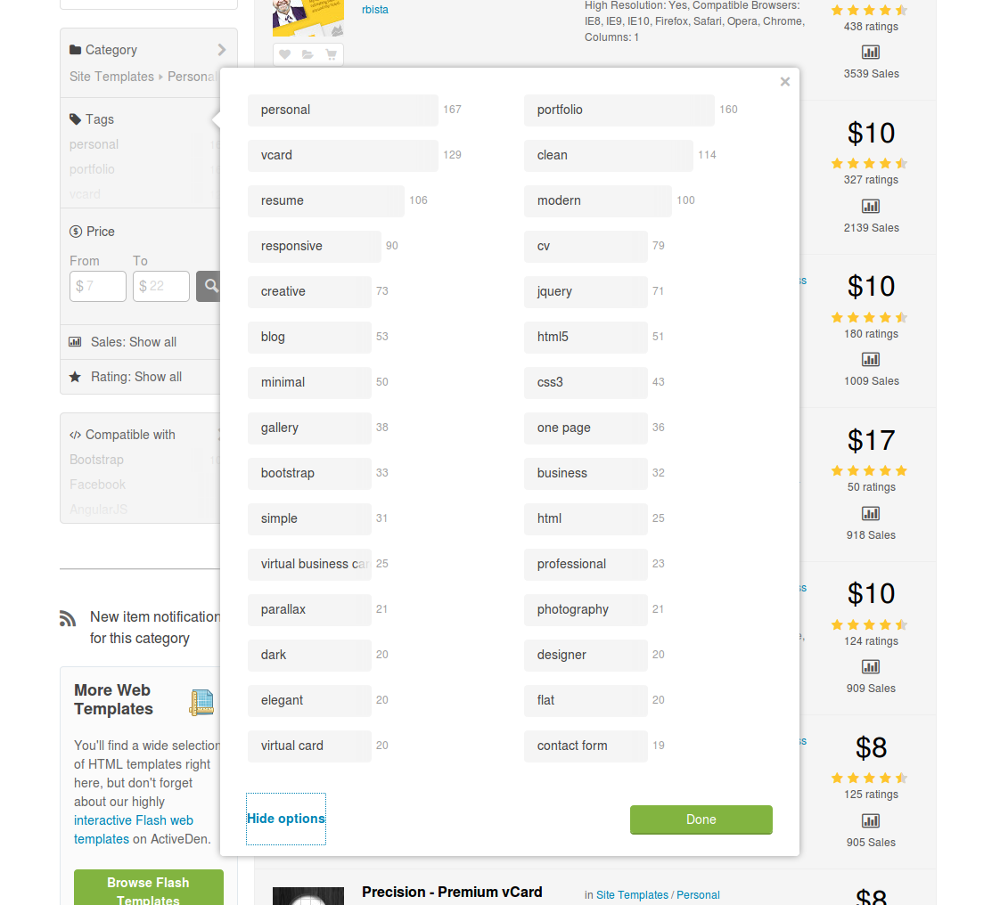

# Themes Research

* [Current market](#current-market)
* [Similar services](#similar-services)
* [Builders](#builders)
* [Personas](#personas)

## Current market

### Developers

#### Superstars

* https://addyosmani.com/
* http://zachholman.com/
* http://sarasoueidan.com/
* http://www.stubbornella.org/content/
* https://www.rachelandrew.co.uk/
* http://scottjehl.com/
* http://hugogiraudel.com/
* http://www.keithclark.co.uk/
* http://maban.co.uk/
* http://laurakalbag.com/
* http://tholman.com/
* http://lea.verou.me/
* http://www.bramstein.com/
* http://timkadlec.com/
* http://pixelscommander.com/en
* http://pad.gs/

#### Following Reindex.io on Twitter

Form the 67 followers 19 have personal pages.
All people seems to have a Github account.
Devs like to blog.

* http://namuol.github.io/
* http://pascal-brewing.de/
* http://jonathanwerner.net/
* http://elliottsj.com/
* http://gilbox.me/
* http://www.gnuton.org/
* http://blogwaffe.com/
* https://foricontainmultitudes.wordpress.com/
* http://gothy.me/
* http://www.donaldkelsey.com/
* http://songawee.com/
* http://alekseykulikov.com/
* http://varya.me/
* http://www.vullum.io/ -> paid theme
* http://arturoromerotcs.github.io/
* http://nxhx.org/
* http://ivarbergman.se/
* https://about.me/shanabrook
* http://www.nrako.com/

### Themeforrest

From the best seller [HTML templates](http://themeforest.net/search?utf8=%E2%9C%93&term=&view=list&sort=sales&date=&category=site-templates&price_min=&price_max=&sales=&rating_min=):

* The top 10-15+ are about Admin, Corporate / Business with a few Creative templates
* In the top 30 there is a resume-like template [Zwin](http://themeforest.net/item/zwin-responsive-vcard-template/full_screen_preview/1970657) for $7 with 3500+ sales not updated since 2013
* In the top 100 there is another CV like template [Clean CV](http://themeforest.net/item/clean-cv-responsive-resume-template-4-bonuses/full_screen_preview/82474) for $11 with 2300+ sales updated recently

In the "Personal Website Templates" we have 264 items from [$7-$22](http://themeforest.net/search?utf8=%E2%9C%93&term=&view=list&sort=sales&date=&category=site-templates%2Fpersonal&price_min=&price_max=&sales=&rating_min=)

The best rated are:

* http://themeforest.net/item/confidence-responsive-vcard-template/full_screen_preview/6471837
* http://themeforest.net/item/palladium-creative-responsive-portfolio/full_screen_preview/4848927
* http://themeforest.net/item/gaiz-clean-horizontal-scrolling-responsive-vcard/full_screen_preview/4552964
* http://themeforest.net/item/bionick-responsive-personal-portfolio-template/full_screen_preview/11860143

The trending are:

* http://www.wp4life.com/?product=divergent
* http://aboutn.com/evt_profile/themeselector/index.php?theme=Promotico
* http://themeforest.net/item/sharon-vcard-personal-portfolio-resume-templates/full_screen_preview/7095028
* http://preview.imithemes.com/?theme=Solotrio

In http://themeforest.net/tags/developer there are 60 templates a few of them are for portfolios

* http://themeforest.net/item/vertica-retina-ready-resume-cv-portfolio/full_screen_preview/8536870
* http://themes.profteamsolutions.com/identity-vcard/?page_id=21
* http://themeforest.net/item/the-triton-multipage-portfolio-template/full_screen_preview/11446555
* http://themeforest.net/item/savvy-personal-vcard-resume-portfolio-template/full_screen_preview/10811117
* http://darwinthemes.com/retouch/html/theme/index-blue.html

Obeservations:

* There is no "Developer" subsection here. 
* All templates look mainstream, on hype, and bloated with sliders, big background images, videos, superstar stock photos etc etc

### Google search for "developer portfolio template" or "theme"

* http://www.bootstrapzero.com/templates/portfolio
* http://scripteden.com/downloads/html5/
* https://wrapbootstrap.com/themes/portfolios

Observations

* Same approach as Themeforrest: bloated
* the query is fully associated with *Bootstrap*

### Google search for "Githup pages template" or "theme"

* https://github.com/jekyll/jekyll/wiki/Themes
* http://jekyllthemes.org/
* http://jekyllthemes.io/

Observations

* Mostly blogging themes
* Fully associated with Jekyll
* Links to [Static Site Generators on Themeforrest](http://themeforest.net/category/static-site-generators)

## Similar services

* https://about.me/
* http://resume.github.io/?defunkt
* https://github.com/metamn/themes/generated_pages/themes

## Builders

* http://scripteden.com/builder/bootstrap/

## Personas

* Back-end developer
* Front-end developer
* App developer
* Full stack developer
